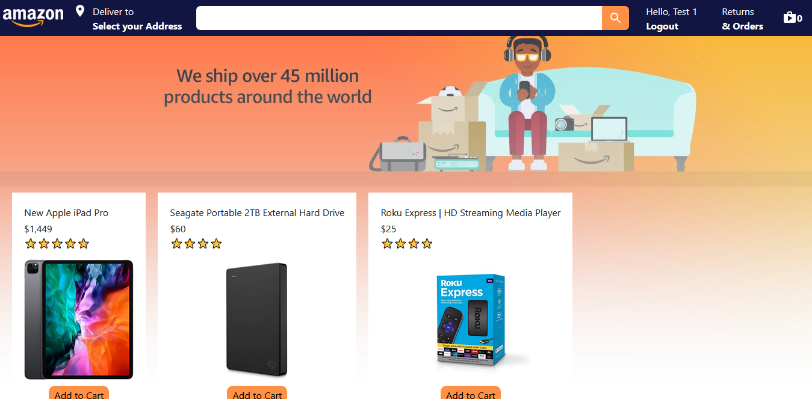
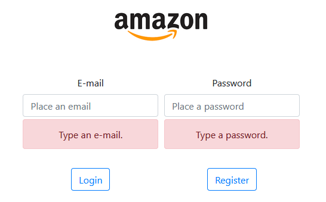

# Amazon clone front-end



> This project was inspired by the same project the youtube's channel Clever Programmer did in one week.


---

### Table of Contents

- [Description](#description)
- [How To Use](#how-to-use)
- [References](#references)
- [Author Info](#author-info)

---

## Description

It has a purpose to improve my knowledge on ReactJS, Java Spring Boot and recycling my habilities on HTML, CSS and JavaScript.

As I said before, it is inspired by the youtube's channel Clever Programmer's amazon clone project, which they built in one week. Their project has Google Authentication, add to and delete from cart functionallity, which increases the amount of items of that product on cart each time you click on "Add to cart". Its database are built on Firebase.

My version of their project has its own simple user authentication.



First of all, it has their functionallity of adding to and deleting from cart, with the addition that each product has its own quantity on stock. When I add to cart, this quantity will be the default quantity of that item on cart.


> User Test 1 home page. 
 


> User Test 1 cart page.
 
 Secondly, it contains an administration user, called admin.

 

 > Administration home page.
 
 Moreover, it has the functionallities of creating, editing and deleting products.

 

 > Administration home page.
 
 And editing and deleting users.

 

 > Administration home page.
 
 The main url for this project is: https://myownamazonclone.herokuapp.com/ . The users credentials are:

 E-mail-----------------Password

 test1@email.com--------1234

 test2@email.com--------123467

 admin------------------1234

#### Technologies

- HTML
- CSS
- JavaScript
- Node
- ReactJS
- Java Spring Boot

[Back To The Top](#Amazon-clone-front-end)

---

## How To Use

#### Installation
First of all, you need download the project from my github repository to your local machine.

```
git clone 'https://github.com/nagaoka-thiago/amazon-clone-frontend.git'
```

Secondly, use terminal to access the created folder, which should be called "amazon-clone-frontend". And then use the following command line to install the dependencies needed for the project to run.

```
npm i
```

Finally, use the following line to run the project.

```
npm start
```
[Back To The Top](#Amazon-clone-front-end)
---

## References
[Clever Programmer's Amazon clone - Day one](https://www.youtube.com/watch?v=-j9B5whi7Lw)

[Clever Programmer's Amazon clone - Day two](https://www.youtube.com/watch?v=W5j0dpHxCj4)

[Clever Programmer's Amazon clone - Day three](https://www.youtube.com/watch?v=m0_13iV3F2o)

[Spring boot](https://docs.spring.io/spring-boot/docs/current/reference/htmlsingle/#getting-started)

[Back To The Top](#Amazon-clone-front-end)
---

## Author Info

- Linkedin - [Thiago Nagaoka](https://www.linkedin.com/in/nagaokathiago/)

[Back To The Top](#Amazon-clone-front-end)